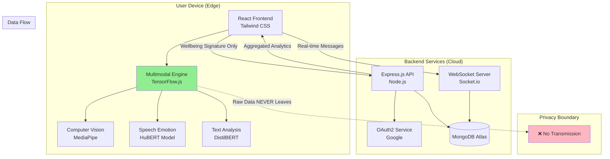
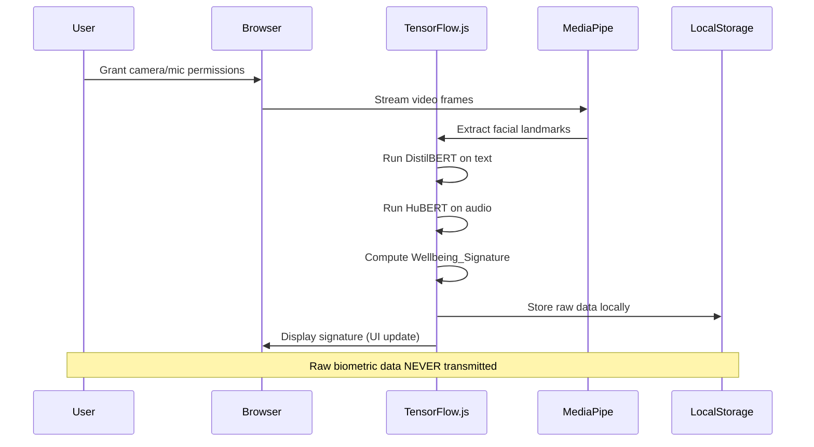
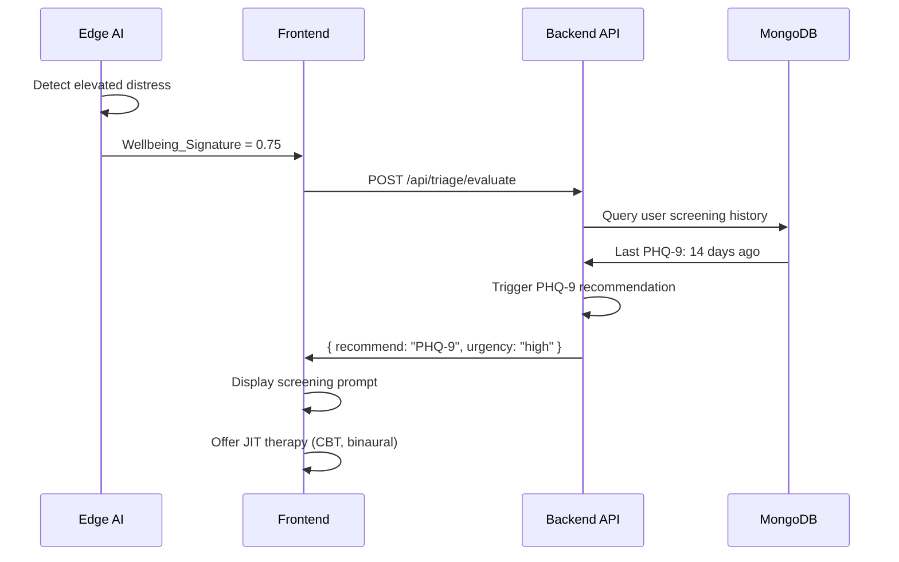
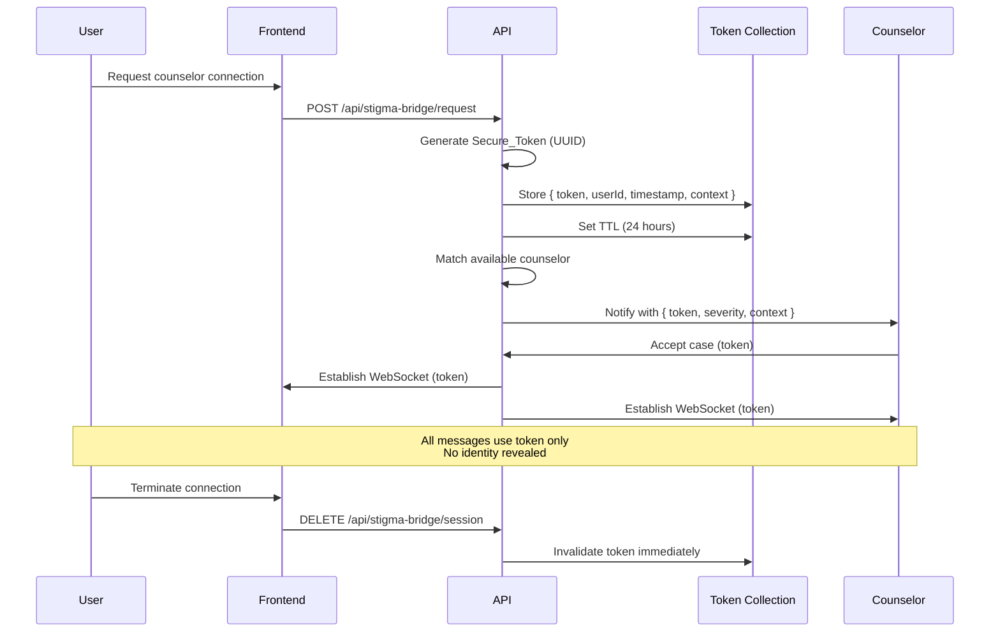
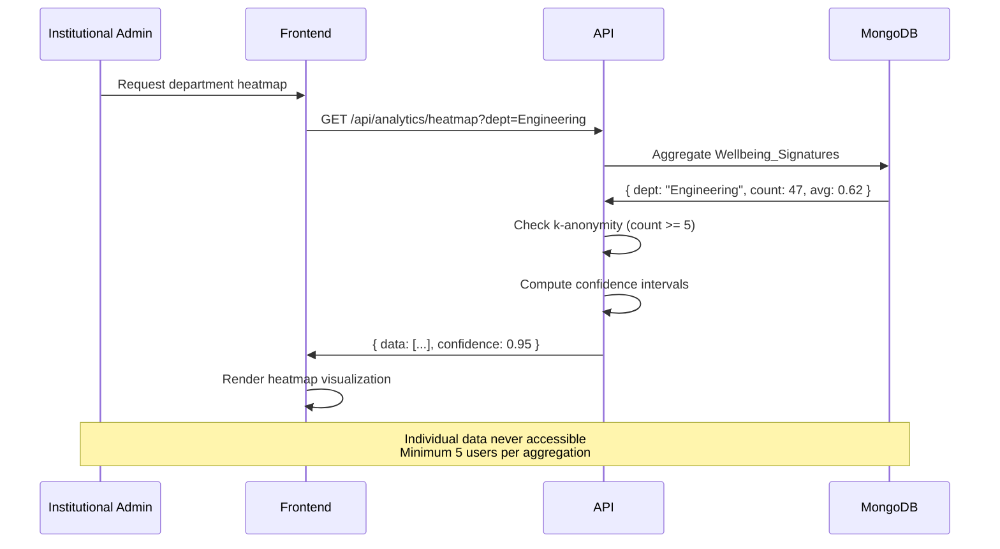
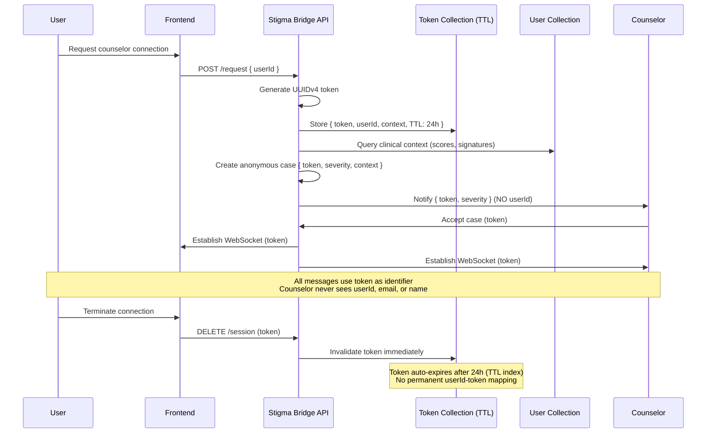
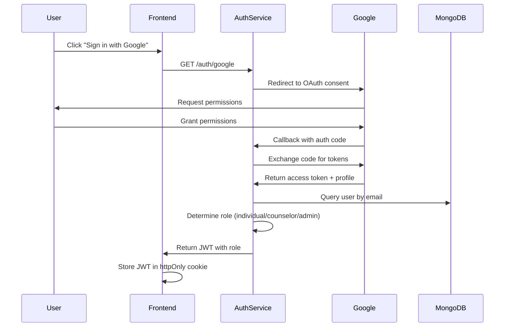

# Design Document: tesseract45

## Overview

tesseract45 is a privacy-first mental health ecosystem that provides proactive wellbeing monitoring through edge-based multimodal AI processing. The architecture is designed around three core principles:

1. **Privacy by Architecture**: All raw biometric data (facial landmarks, vocal signatures, text) is processed exclusively on the user's device using TensorFlow.js. Only derived metrics (Wellbeing_Signature scores) are transmitted to the backend.

2. **Anonymous Professional Support**: The Stigma_Bridge system uses cryptographic tokens to enable counselor connections without revealing user identity, eliminating institutional stigma barriers.

3. **Aggregated Institutional Insights**: Organizations receive statistical heatmaps showing departmental stress patterns with strict k-anonymity (minimum 5 individuals per aggregation) to prevent re-identification.

The system serves three distinct user types: Individual Users seeking proactive mental health support, Counselors providing anonymous professional care, and Institutional Admins monitoring organizational wellbeing trends.

## Architecture

### High-Level System Architecture



### Component Architecture

**Frontend Layer (React + TensorFlow.js)**
- Individual Dashboard: Wellbeing visualization, JIT therapy interface, screening tools
- Counselor Portal: Anonymous case management, real-time messaging
- Institutional Dashboard: Aggregated heatmaps, trend analysis
- Edge AI Engine: Local biometric processing with no external data transmission

**Backend Layer (Node.js + Express)**
- Authentication Service: Google OAuth2 integration with role-based access control
- Triage Service: Dynamic screening triggers based on Wellbeing_Signature thresholds
- Stigma Bridge Service: Secure token generation and counselor matching
- Analytics Service: Aggregation engine with k-anonymity enforcement
- Real-time Communication: Socket.io for counselor-user messaging

**Data Layer (MongoDB Atlas)**
- User Collection: Encrypted profiles, Wellbeing_Signature history, screening results
- Token Collection: Temporary Secure_Token mappings (auto-expire after session)
- Organization Collection: Institutional hierarchies, aggregation configurations
- Conversation Collection: Anonymous message logs with token references only

### Data Flow Diagrams

#### Biometric Processing Flow (Edge-Only)



#### Dynamic Triage Flow



#### Anonymous Counselor Connection Flow (Stigma Bridge)



#### Institutional Heatmap Aggregation Flow



## Components and Interfaces

### Frontend Components

#### 1. Multimodal Engine (Edge AI)

**Responsibilities:**
- Load and manage TensorFlow.js models (DistilBERT, HuBERT, MediaPipe)
- Process facial landmarks, speech patterns, and text sentiment locally
- Compute unified Wellbeing_Signature from multimodal inputs
- Store raw biometric data in browser IndexedDB (never transmitted)

**Key Methods:**
```typescript
interface MultimodalEngine {
  initialize(): Promise<void>;
  processFacialLandmarks(videoFrame: ImageData): EmotionVector;
  processSpeechEmotion(audioBuffer: Float32Array): EmotionVector;
  processTextSentiment(text: string): EmotionVector;
  computeWellbeingSignature(vectors: EmotionVector[]): number;
  getHistoricalSignatures(days: number): WellbeingHistory;
}
```

#### 2. Individual Dashboard

**Responsibilities:**
- Display real-time Wellbeing_Signature with visual indicators
- Render historical trends and screening results
- Present JIT therapy recommendations (CBT modules, binaural beats, journaling)
- Provide counselor connection interface

**Key Components:**
- `WellbeingChart`: Line chart showing signature trends
- `TriageAlert`: Modal for PHQ-9/GAD-7 screening prompts
- `TherapyCard`: Interactive cards for JIT interventions
- `CounselorConnect`: Anonymous connection request interface

#### 3. Counselor Portal

**Responsibilities:**
- Display available anonymous cases with severity indicators
- Provide real-time messaging interface using Secure_Tokens
- Show clinical context (screening scores, signature trends) without identity
- Track session duration and engagement metrics

**Key Components:**
- `CaseQueue`: List of available anonymous referrals
- `AnonymousChat`: WebSocket-based messaging component
- `ClinicalContext`: Read-only display of user's wellbeing data
- `SessionControls`: End session, request supervision, flag crisis

#### 4. Institutional Dashboard

**Responsibilities:**
- Render departmental heatmaps with color-coded stress levels
- Display temporal trends across organizational units
- Provide filtering by department, role, time period
- Show confidence intervals and sample sizes

**Key Components:**
- `HeatmapGrid`: Interactive grid visualization of stress hotspots
- `TrendChart`: Time-series analysis of organizational wellbeing
- `FilterPanel`: Department and date range selectors
- `PrivacyIndicator`: Display of k-anonymity compliance status

### Backend Services

#### 1. Authentication Service

**Endpoints:**
```
POST /api/auth/google
  - Initiates Google OAuth2 flow
  - Returns: { redirectUrl: string }

POST /api/auth/callback
  - Handles OAuth2 callback
  - Validates user role (individual, counselor, admin)
  - Returns: { token: JWT, role: string, userId: string }

POST /api/auth/refresh
  - Refreshes expired session token
  - Returns: { token: JWT }

POST /api/auth/logout
  - Invalidates session token
  - Returns: { success: boolean }
```

**Role Verification Logic:**
- Individual: Any valid Google account
- Counselor: Email must be in pre-approved counselor list
- Institutional Admin: Email domain must match registered organization

#### 2. Triage Service

**Endpoints:**
```
POST /api/triage/evaluate
  - Input: { userId: string, wellbeingSignature: number }
  - Logic: Check signature thresholds and screening history
  - Returns: { recommend: "PHQ-9" | "GAD-7" | null, urgency: string }

POST /api/triage/screening-result
  - Input: { userId: string, type: "PHQ-9" | "GAD-7", score: number }
  - Stores screening result with timestamp
  - Returns: { stored: boolean, interpretation: string }

GET /api/triage/history/:userId
  - Returns: Array of past screening results and recommendations
```

**Threshold Logic:**
- Wellbeing_Signature < 0.4: Trigger PHQ-9 (depression screening)
- Wellbeing_Signature < 0.5 with anxiety indicators: Trigger GAD-7
- No duplicate recommendations within 7 days

#### 3. Stigma Bridge Service

**Endpoints:**
```
POST /api/stigma-bridge/request
  - Input: { userId: string, severity: number, context: string }
  - Generates UUID Secure_Token
  - Stores temporary mapping with 24-hour TTL
  - Matches available counselor
  - Returns: { token: string, estimatedWait: number }

GET /api/stigma-bridge/case/:token
  - Input: Secure_Token (counselor authentication required)
  - Returns: { severity: number, context: string, screeningScores: [] }
  - Does NOT return userId or any identifying information

DELETE /api/stigma-bridge/session/:token
  - Invalidates token immediately
  - Closes WebSocket connections
  - Returns: { terminated: boolean }

GET /api/stigma-bridge/queue
  - Returns: Array of available cases for counselor matching
  - Each case: { token: string, severity: number, waitTime: number }
```

**Token Security:**
- Tokens are UUIDv4 (cryptographically random)
- Stored in separate collection with TTL index (auto-delete after 24 hours)
- No reverse lookup from token to userId in persistent storage
- Mapping exists only in memory during active session

#### 4. Analytics Service

**Endpoints:**
```
GET /api/analytics/heatmap
  - Input: { orgId: string, department?: string, startDate: Date, endDate: Date }
  - Aggregates Wellbeing_Signatures with k-anonymity enforcement
  - Returns: { cells: [{ dept: string, avg: number, count: number }], confidence: number }

GET /api/analytics/trends
  - Input: { orgId: string, granularity: "daily" | "weekly" }
  - Returns: Time-series data with confidence intervals

GET /api/analytics/summary
  - Returns: Organization-wide statistics (total users, avg signature, screening rates)
```

**K-Anonymity Enforcement:**
- All aggregations require minimum 5 users
- If count < 5, return null with privacy warning
- Add statistical noise to prevent inference attacks
- Compute confidence intervals based on sample size

#### 5. Real-Time Communication Service (Socket.io)

**Events:**
```
// Client -> Server
"message:send" { token: string, content: string, timestamp: Date }
"typing:start" { token: string }
"typing:stop" { token: string }

// Server -> Client
"message:receive" { content: string, timestamp: Date, sender: "user" | "counselor" }
"typing:indicator" { isTyping: boolean }
"session:terminated" { reason: string }
```

**Connection Management:**
- Authenticate using Secure_Token on connection
- Maintain separate rooms per token
- Broadcast messages only to participants in the same room
- Log all messages with token reference (not userId)

## Data Models

### User Collection

```typescript
interface User {
  _id: ObjectId;
  email: string; // From Google OAuth
  role: "individual" | "counselor" | "admin";
  organizationId?: ObjectId; // For institutional users
  profile: {
    displayName: string;
    createdAt: Date;
    lastActive: Date;
  };
  wellbeingHistory: Array<{
    timestamp: Date;
    signature: number; // 0.0 to 1.0
    modalities: {
      facial?: number;
      speech?: number;
      text?: number;
    };
  }>;
  screeningResults: Array<{
    type: "PHQ-9" | "GAD-7";
    score: number;
    timestamp: Date;
    triggeredBy: "manual" | "triage";
  }>;
  therapyEngagement: Array<{
    type: "CBT" | "binaural" | "journaling";
    timestamp: Date;
    duration: number;
    completed: boolean;
  }>;
  preferences: {
    triageEnabled: boolean;
    jitTherapyEnabled: boolean;
    notificationsEnabled: boolean;
  };
}
```

### Token Collection (Temporary)

```typescript
interface SecureToken {
  _id: ObjectId;
  token: string; // UUIDv4
  userId: ObjectId; // Reference to User
  counselorId?: ObjectId; // Assigned counselor
  status: "pending" | "active" | "terminated";
  clinicalContext: {
    severity: number;
    recentSignatures: number[];
    screeningScores: Array<{ type: string; score: number }>;
  };
  createdAt: Date;
  expiresAt: Date; // TTL index (24 hours)
  terminatedAt?: Date;
}
```

### Organization Collection

```typescript
interface Organization {
  _id: ObjectId;
  name: string;
  domain: string; // Email domain for admin verification
  structure: Array<{
    departmentId: string;
    departmentName: string;
    parentDepartment?: string;
  }>;
  config: {
    minAggregationSize: number; // Default: 5 (k-anonymity)
    heatmapRefreshInterval: number; // Minutes
    enabledFeatures: string[];
  };
  admins: ObjectId[]; // User IDs with admin role
  counselors: ObjectId[]; // Assigned counselors
  createdAt: Date;
}
```

### Conversation Collection

```typescript
interface Conversation {
  _id: ObjectId;
  token: string; // Reference to SecureToken (not userId)
  messages: Array<{
    sender: "user" | "counselor";
    content: string;
    timestamp: Date;
    encrypted: boolean;
  }>;
  metadata: {
    startedAt: Date;
    endedAt?: Date;
    duration?: number; // Seconds
    messageCount: number;
  };
}
```

### Edge-Only Data (IndexedDB - Never Transmitted)

```typescript
interface LocalBiometricData {
  timestamp: Date;
  facialLandmarks?: {
    landmarks: Float32Array; // 468 MediaPipe landmarks
    emotions: { joy: number; sadness: number; anger: number; fear: number };
  };
  speechFeatures?: {
    mfcc: Float32Array; // Mel-frequency cepstral coefficients
    pitch: number;
    energy: number;
    emotions: { neutral: number; happy: number; sad: number; angry: number };
  };
  textAnalysis?: {
    text: string;
    sentiment: { positive: number; negative: number; neutral: number };
    keywords: string[];
  };
}
```


## Correctness Properties

*A property is a characteristic or behavior that should hold true across all valid executions of a system—essentially, a formal statement about what the system should do. Properties serve as the bridge between human-readable specifications and machine-verifiable correctness guarantees.*

### Property Reflection

After analyzing all acceptance criteria, I identified several areas of redundancy:

- Properties 5.2 and 5.3 both test that PII is not transmitted during counselor handover - these can be combined into a single comprehensive privacy property
- Properties 2.1, 2.2, and 2.3 all test that individual modalities contribute to the signature - these can be combined into one property about multimodal integration
- Properties 4.2, 4.3, and 4.4 all test that therapy recommendations match user state - these can be combined into one comprehensive property
- Properties 10.1 and 1.4 both test that raw biometric data stays local - these are the same property stated differently
- Properties 6.2 and 13.6 both test that admins/counselors cannot access identity information - these can be combined

The following properties represent the unique, non-redundant correctness guarantees for tesseract45:

### Privacy and Data Locality Properties

**Property 1: Raw biometric data locality**

*For any* biometric processing session (facial, vocal, or text), the raw input data should never appear in network requests, and should only be stored in local device storage (IndexedDB).

**Validates: Requirements 1.4, 10.1**

**Property 2: Offline biometric processing**

*For any* biometric input when the device is offline, the Multimodal_Engine should successfully process the input and generate a Wellbeing_Signature without network connectivity.

**Validates: Requirements 1.6**

**Property 3: Stigma Bridge anonymity**

*For any* counselor connection request, the data transmitted to the backend should contain only the Secure_Token and clinical context (severity, screening scores), and should not contain any personally identifiable information (email, name, userId in plaintext).

**Validates: Requirements 5.2, 5.3**

**Property 4: Token-only conversation storage**

*For any* conversation message stored in the database, the record should reference only the Secure_Token, not the user's identity (userId should not appear in the Conversation collection).

**Validates: Requirements 10.3**

**Property 5: Temporary token mappings**

*For any* Secure_Token, the mapping between token and userId should not exist in persistent storage after the session ends (only in temporary Token collection with TTL).

**Validates: Requirements 10.4**

**Property 6: Role-based data access control**

*For any* Institutional_Admin or Counselor, they should not be able to query or access individual user identities, raw biometric data, or token-to-user mappings through any API endpoint.

**Validates: Requirements 6.2, 13.6**

### Multimodal Processing Properties

**Property 7: Multimodal signature integration**

*For any* combination of facial, vocal, and text inputs, the Multimodal_Engine should produce a unified Wellbeing_Signature that reflects contributions from all available modalities (signature should change when any modality input changes).

**Validates: Requirements 2.1, 2.2, 2.3, 2.4**

**Property 8: Real-time signature updates**

*For any* new biometric input, the Wellbeing_Signature should update within 5 seconds, and the updated value should be reflected in the UI.

**Validates: Requirements 2.5**

**Property 9: Signature persistence**

*For any* generated Wellbeing_Signature, storing it locally should make it retrievable in the historical data query (round-trip property).

**Validates: Requirements 2.6**

### Dynamic Triage Properties

**Property 10: Distress-based PHQ-9 triggering**

*For any* Wellbeing_Signature below the distress threshold (< 0.4), the Dynamic_Triage should recommend a PHQ-9 screening if no PHQ-9 has been completed in the last 7 days.

**Validates: Requirements 3.1**

**Property 11: Anxiety-based GAD-7 triggering**

*For any* Wellbeing_Signature below the anxiety threshold (< 0.5) with anxiety indicators present, the Dynamic_Triage should recommend a GAD-7 screening if no GAD-7 has been completed in the last 7 days.

**Validates: Requirements 3.2**

**Property 12: Screening result persistence and triage integration**

*For any* completed screening (PHQ-9 or GAD-7), storing the result should prevent duplicate recommendations of the same screening type within the configured time window (7 days).

**Validates: Requirements 3.4, 3.5**

### Just-in-Time Therapy Properties

**Property 13: Context-appropriate therapy recommendations**

*For any* detected Distress_Signal with specific emotional characteristics (e.g., high sadness, high anxiety), the offered JIT_Therapy options (CBT modules, binaural beats, journaling prompts) should be appropriate to that emotional state.

**Validates: Requirements 4.1, 4.2, 4.3, 4.4**

**Property 14: Therapy engagement tracking**

*For any* accepted JIT_Therapy intervention, engagement data (type, timestamp, duration, completion status) should be stored locally and retrievable in the therapy history.

**Validates: Requirements 4.5**

### Stigma Bridge and Counselor Connection Properties

**Property 15: Unique token generation**

*For any* counselor connection request, the generated Secure_Token should be unique (no collisions with existing active tokens).

**Validates: Requirements 5.1**

**Property 16: Secure channel establishment**

*For any* counselor-accepted connection, a bidirectional WebSocket communication channel should be established, and both parties should be able to send and receive messages through it.

**Validates: Requirements 5.4, 6.3, 6.4**

**Property 17: Token invalidation on termination**

*For any* active connection, when either party terminates it, the Secure_Token should become invalid and any subsequent attempts to use it should fail.

**Validates: Requirements 5.6**

**Property 18: Termination notification**

*For any* user-initiated connection termination, the assigned Counselor should receive a notification within 5 seconds.

**Validates: Requirements 6.5**

**Property 19: Session log access control**

*For any* conversation session, only the assigned Counselor and the anonymous user (via token) should be able to access the message logs; other users should receive access denied errors.

**Validates: Requirements 6.6**

### Institutional Analytics Properties

**Property 20: Aggregation without identifiers**

*For any* organizational heatmap or analytics query, the aggregated result should not contain individual user identifiers (userId, email, name).

**Validates: Requirements 7.1**

**Property 21: K-anonymity enforcement**

*For any* heatmap cell or aggregation, if the count of individuals is less than 5, the cell should be suppressed (return null or "insufficient data") to prevent re-identification.

**Validates: Requirements 7.2**

**Property 22: Heatmap filtering**

*For any* filter criteria (department, role, date range), applying the filter should update the heatmap to show only data matching those criteria, while still enforcing k-anonymity.

**Validates: Requirements 7.4**

**Property 23: No drill-down to individuals**

*For any* aggregated metric, there should be no API endpoint or UI interaction that allows drilling down to individual user data.

**Validates: Requirements 7.5**

**Property 24: Confidence interval computation**

*For any* aggregated metric, the response should include confidence intervals computed based on the sample size and variance.

**Validates: Requirements 7.6**

### Authentication and Authorization Properties

**Property 25: Role-based token issuance**

*For any* successful OAuth2 authentication, the issued session token should contain the correct role (individual, counselor, admin) based on the user's email and organizational affiliation.

**Validates: Requirements 8.4**

**Property 26: Session expiration**

*For any* session token, if the user is inactive for longer than the configured timeout period, subsequent API requests should fail with an authentication error.

**Validates: Requirements 8.5**

**Property 27: Re-authentication for sensitive operations**

*For any* sensitive operation (counselor connection request, account deletion), if the session is older than the re-authentication threshold, the system should require fresh authentication.

**Validates: Requirements 8.6**

### Real-Time Communication Properties

**Property 28: Message delivery status**

*For any* message sent through the WebSocket channel, the sender should receive a delivery status update (sent, delivered, or failed).

**Validates: Requirements 9.3**

**Property 29: Message ordering preservation**

*For any* sequence of messages sent in order [M1, M2, M3], the recipient should receive them in the same order [M1, M2, M3].

**Validates: Requirements 9.4**

**Property 30: Offline message queuing**

*For any* messages sent while the device is offline, they should be queued locally and transmitted in order when connectivity is restored.

**Validates: Requirements 9.5**

### Data Persistence and Encryption Properties

**Property 31: Encrypted signature storage**

*For any* Wellbeing_Signature or screening result stored in the database, the data should be encrypted at rest (verifiable by checking that raw database records are not plaintext).

**Validates: Requirements 10.2**

**Property 32: Account deletion completeness**

*For any* user account deletion request, all associated data (wellbeing history, screening results, therapy engagement, conversations) should be permanently removed from the database within 30 days.

**Validates: Requirements 10.5**

### Data Export Properties

**Property 33: Wellbeing data export round-trip**

*For any* user's wellbeing data, exporting it to JSON format and then parsing the JSON should produce data equivalent to the original (round-trip property).

**Validates: Requirements 11.5**

### AI Model Management Properties

**Property 34: Model caching**

*For any* TensorFlow.js model loaded during a session, it should be cached in browser storage, and subsequent sessions should load from cache rather than re-downloading.

**Validates: Requirements 12.2**

**Property 35: Model update with fallback**

*For any* model update attempt, if the download fails (network error), the system should fall back to the cached model and continue functioning.

**Validates: Requirements 12.3, 12.4**

### Institutional Configuration Properties

**Property 36: Organizational structure definition**

*For any* organizational hierarchy defined by an admin (departments, parent-child relationships), the structure should be stored and retrievable for heatmap filtering.

**Validates: Requirements 13.1**

**Property 37: Aggregation threshold configuration**

*For any* minimum aggregation threshold set by an admin (e.g., 5, 10), the heatmap generation should enforce that threshold (no cells with count below threshold).

**Validates: Requirements 13.2**

**Property 38: User invitation with domain validation**

*For any* user invited by an Institutional_Admin, when they authenticate, their email domain should match the organization's registered domain, or authentication should fail.

**Validates: Requirements 13.3, 13.4**

**Property 39: Counselor assignment**

*For any* Counselor assigned to an organization by an admin, they should appear in the organization's counselor pool and be eligible for case matching from that organization.

**Validates: Requirements 13.5**

### Accessibility Properties

**Property 40: Keyboard navigation completeness**

*For any* interactive UI element (buttons, links, form inputs), it should be reachable and operable using only keyboard navigation (Tab, Enter, Space, Arrow keys).

**Validates: Requirements 14.2**

**Property 41: Screen reader label presence**

*For any* UI component, it should have an appropriate ARIA label or accessible name that screen readers can announce.

**Validates: Requirements 14.3**

**Property 42: Audio content text alternatives**

*For any* audio-based JIT_Therapy content (binaural beats, guided meditation), there should be a text alternative or transcript available.

**Validates: Requirements 14.5**

**Property 43: Font size scalability**

*For any* font size setting (100%, 150%, 200%), the UI layout should remain functional without text overflow or broken layouts.

**Validates: Requirements 14.6**

### Error Handling and Resilience Properties

**Property 44: Graceful modality degradation**

*For any* biometric processing failure (e.g., camera access denied), the system should display an error message and continue functioning with the remaining available modalities.

**Validates: Requirements 15.1**

**Property 45: Offline feature continuity**

*For any* edge-based feature (biometric processing, local data visualization), it should continue functioning when network connectivity is lost.

**Validates: Requirements 15.2**

**Property 46: Connection interruption recovery**

*For any* counselor connection interrupted by network issues, the system should attempt automatic reconnection with exponential backoff, and notify both parties of the reconnection status.

**Validates: Requirements 15.3**

**Property 47: Database operation retry**

*For any* failed database operation (timeout, connection error), the system should retry with exponential backoff (e.g., 1s, 2s, 4s) before notifying the user of failure.

**Validates: Requirements 15.4**

**Property 48: Privacy-preserving error logs**

*For any* error logged by the system, the log entry should contain sufficient debugging context (error type, stack trace, component) but should not contain sensitive user data (biometric data, PII, tokens).

**Validates: Requirements 15.5**


## Security and Privacy Architecture

### Privacy-by-Design Principles

tesseract45 implements privacy at the architectural level through three core mechanisms:

#### 1. Edge-Based Biometric Processing

**Architecture:**
- All TensorFlow.js models (DistilBERT, HuBERT, MediaPipe) run entirely in the browser
- Raw biometric data (facial landmarks, audio buffers, text) never leaves the device
- Only derived metrics (Wellbeing_Signature scores) are transmitted to the backend
- Local storage uses browser IndexedDB with encryption

**Implementation:**
```typescript
// Pseudocode for edge processing
class MultimodalEngine {
  async processBiometrics(inputs: BiometricInputs): Promise<WellbeingSignature> {
    // All processing happens locally
    const facialEmotions = await this.cvModel.analyze(inputs.videoFrame);
    const speechEmotions = await this.serModel.analyze(inputs.audioBuffer);
    const textSentiment = await this.nlpModel.analyze(inputs.text);
    
    // Compute signature locally
    const signature = this.computeSignature([facialEmotions, speechEmotions, textSentiment]);
    
    // Store raw data locally only
    await this.localDB.store({
      timestamp: Date.now(),
      rawData: inputs, // NEVER transmitted
      signature: signature // Only this goes to backend
    });
    
    return signature;
  }
}
```

**Privacy Guarantees:**
- Network monitoring should show zero raw biometric data in HTTP/WebSocket payloads
- Backend database contains no facial landmarks, audio waveforms, or unprocessed text
- User maintains complete control over raw data (can delete locally at any time)

#### 2. Stigma Bridge: Anonymous Counselor Connection

**Problem:** Traditional mental health referrals require identity disclosure, creating institutional stigma barriers.

**Solution:** Cryptographic token-based anonymization that separates identity from clinical context.

**Architecture:**



**Implementation Details:**

**Token Generation:**
```typescript
// Pseudocode for Stigma Bridge
class StigmaBridgeService {
  async createAnonymousConnection(userId: string): Promise<SecureToken> {
    // Generate cryptographically random token
    const token = crypto.randomUUID(); // UUIDv4
    
    // Fetch clinical context WITHOUT identity
    const context = await this.getClinicalContext(userId);
    
    // Store temporary mapping with TTL
    await this.tokenCollection.insertOne({
      token: token,
      userId: userId, // Only in temporary collection
      severity: context.severity,
      recentSignatures: context.signatures,
      screeningScores: context.scores,
      createdAt: new Date(),
      expiresAt: new Date(Date.now() + 24 * 60 * 60 * 1000) // 24 hours
    });
    
    // Create TTL index for automatic deletion
    await this.tokenCollection.createIndex(
      { expiresAt: 1 },
      { expireAfterSeconds: 0 }
    );
    
    return token;
  }
  
  async getClinicalContext(userId: string): Promise<ClinicalContext> {
    const user = await this.userCollection.findOne({ _id: userId });
    
    // Return ONLY clinical data, NO identity
    return {
      severity: this.computeSeverity(user.wellbeingHistory),
      signatures: user.wellbeingHistory.slice(-10).map(h => h.signature),
      scores: user.screeningResults.map(s => ({ type: s.type, score: s.score }))
      // NO email, NO name, NO userId
    };
  }
}
```

**Counselor View:**
```typescript
// Counselor sees only anonymous case data
interface AnonymousCase {
  token: string; // Secure identifier
  severity: number; // 0.0 to 1.0
  recentSignatures: number[]; // Trend data
  screeningScores: Array<{ type: string; score: number }>;
  waitTime: number; // Minutes since request
  // NO userId, NO email, NO name, NO organization
}
```

**Privacy Guarantees:**
- Counselors never see user identity (email, name, userId)
- Token mappings are temporary (24-hour TTL, auto-deleted)
- Conversation logs reference tokens only, not userIds
- No reverse lookup from token to identity in persistent storage
- User can terminate connection instantly, invalidating token

#### 3. K-Anonymity for Institutional Analytics

**Problem:** Organizations need wellbeing insights but must not be able to identify individuals.

**Solution:** Statistical aggregation with k-anonymity enforcement (minimum 5 individuals per cell).

**Architecture:**

```typescript
// Pseudocode for k-anonymity enforcement
class AnalyticsService {
  async generateHeatmap(orgId: string, filters: HeatmapFilters): Promise<Heatmap> {
    const minCount = await this.getOrgConfig(orgId).minAggregationSize; // Default: 5
    
    // Aggregate by department
    const aggregations = await this.userCollection.aggregate([
      { $match: { organizationId: orgId, ...filters } },
      { $group: {
        _id: "$department",
        count: { $sum: 1 },
        avgSignature: { $avg: "$wellbeingHistory.signature" },
        stdDev: { $stdDevPop: "$wellbeingHistory.signature" }
      }}
    ]);
    
    // Enforce k-anonymity
    const anonymizedCells = aggregations.map(cell => {
      if (cell.count < minCount) {
        return {
          department: cell._id,
          data: null, // Suppress cell
          reason: "Insufficient data for privacy (k-anonymity)"
        };
      }
      
      // Add statistical noise to prevent inference attacks
      const noise = this.generateLaplaceNoise(0.01); // Differential privacy
      
      return {
        department: cell._id,
        avgSignature: cell.avgSignature + noise,
        count: cell.count, // Show count to indicate reliability
        confidenceInterval: this.computeCI(cell.avgSignature, cell.stdDev, cell.count)
      };
    });
    
    return { cells: anonymizedCells };
  }
  
  // Prevent drill-down attacks
  async preventDrillDown(query: AnalyticsQuery): void {
    // Block queries that could isolate individuals
    if (query.filters.length > 3) {
      throw new Error("Too many filters - may compromise privacy");
    }
    
    // Block queries on small departments
    const estimatedCount = await this.estimateResultSize(query);
    if (estimatedCount < 5) {
      throw new Error("Query would violate k-anonymity");
    }
  }
}
```

**Privacy Guarantees:**
- No aggregation with fewer than 5 individuals
- No drill-down to individual level
- Statistical noise added to prevent inference attacks
- Confidence intervals indicate reliability
- Admins cannot access individual user data through any API

### Data Encryption

**At Rest:**
- MongoDB Atlas encryption: AES-256
- Browser IndexedDB: Web Crypto API encryption for raw biometric data
- Session tokens: Encrypted JWTs with RS256 signing

**In Transit:**
- All HTTP/WebSocket traffic: TLS 1.3
- Certificate pinning for API endpoints
- HSTS headers enforced

### Authentication and Authorization

**OAuth2 Flow:**


**Role-Based Access Control (RBAC):**

| Role | Permissions |
|------|-------------|
| Individual | Read/write own wellbeing data, request counselor connection, view own dashboard |
| Counselor | Read anonymous cases, send messages via token, view clinical context (no identity) |
| Institutional Admin | Read aggregated analytics, configure organization, invite users, assign counselors |

**Middleware Enforcement:**
```typescript
// Pseudocode for RBAC middleware
function requireRole(allowedRoles: string[]) {
  return async (req, res, next) => {
    const token = req.cookies.jwt;
    const decoded = jwt.verify(token, process.env.JWT_SECRET);
    
    if (!allowedRoles.includes(decoded.role)) {
      return res.status(403).json({ error: "Forbidden" });
    }
    
    req.user = decoded;
    next();
  };
}

// Usage
app.get("/api/analytics/heatmap", requireRole(["admin"]), getHeatmap);
app.post("/api/stigma-bridge/request", requireRole(["individual"]), requestConnection);
app.get("/api/stigma-bridge/queue", requireRole(["counselor"]), getCaseQueue);
```

### Threat Model and Mitigations

**Threat 1: Raw biometric data exfiltration**
- Mitigation: Edge-only processing, network monitoring tests, no backend storage

**Threat 2: Re-identification through aggregated data**
- Mitigation: K-anonymity enforcement, statistical noise, drill-down prevention

**Threat 3: Token-to-identity reverse lookup**
- Mitigation: Temporary token storage with TTL, no persistent mapping, UUIDv4 randomness

**Threat 4: Counselor identity disclosure**
- Mitigation: Token-based communication, no userId in conversation logs, immediate invalidation on termination

**Threat 5: Admin access to individual data**
- Mitigation: RBAC enforcement, aggregation-only APIs, no individual data endpoints for admins

**Threat 6: Session hijacking**
- Mitigation: httpOnly cookies, CSRF tokens, session expiration, re-authentication for sensitive operations

## Error Handling

### Error Categories and Strategies

#### 1. Edge AI Processing Errors

**Scenarios:**
- Camera/microphone permission denied
- Model loading failure
- Inference timeout or crash

**Handling:**
```typescript
// Pseudocode for graceful degradation
class MultimodalEngine {
  async processBiometrics(inputs: BiometricInputs): Promise<WellbeingSignature> {
    const availableModalities = [];
    
    try {
      const facial = await this.cvModel.analyze(inputs.videoFrame);
      availableModalities.push(facial);
    } catch (error) {
      console.error("Facial processing failed:", error);
      this.ui.showWarning("Camera unavailable - using other signals");
    }
    
    try {
      const speech = await this.serModel.analyze(inputs.audioBuffer);
      availableModalities.push(speech);
    } catch (error) {
      console.error("Speech processing failed:", error);
      this.ui.showWarning("Microphone unavailable - using other signals");
    }
    
    try {
      const text = await this.nlpModel.analyze(inputs.text);
      availableModalities.push(text);
    } catch (error) {
      console.error("Text processing failed:", error);
    }
    
    if (availableModalities.length === 0) {
      throw new Error("No modalities available - cannot compute signature");
    }
    
    // Compute signature from available modalities
    return this.computeSignature(availableModalities);
  }
}
```

#### 2. Network Connectivity Errors

**Scenarios:**
- Offline mode
- API timeout
- WebSocket disconnection

**Handling:**
```typescript
// Pseudocode for offline resilience
class OfflineQueue {
  private queue: Array<QueuedOperation> = [];
  
  async executeWithFallback(operation: () => Promise<any>): Promise<any> {
    if (!navigator.onLine) {
      // Queue for later
      this.queue.push({ operation, timestamp: Date.now() });
      this.ui.showInfo("Offline - operation queued");
      return;
    }
    
    try {
      return await operation();
    } catch (error) {
      if (error.code === "NETWORK_ERROR") {
        this.queue.push({ operation, timestamp: Date.now() });
        this.ui.showWarning("Network error - operation queued");
      } else {
        throw error;
      }
    }
  }
  
  async processQueue(): void {
    while (this.queue.length > 0 && navigator.onLine) {
      const item = this.queue.shift();
      try {
        await item.operation();
      } catch (error) {
        console.error("Queue processing failed:", error);
        this.queue.unshift(item); // Re-queue
        break;
      }
    }
  }
}

// Auto-reconnect for WebSocket
class ResilientWebSocket {
  private reconnectAttempts = 0;
  private maxAttempts = 5;
  
  async connect(token: string): Promise<void> {
    try {
      this.socket = io(process.env.WS_URL, { auth: { token } });
      this.reconnectAttempts = 0;
    } catch (error) {
      if (this.reconnectAttempts < this.maxAttempts) {
        const delay = Math.pow(2, this.reconnectAttempts) * 1000; // Exponential backoff
        this.reconnectAttempts++;
        setTimeout(() => this.connect(token), delay);
      } else {
        this.ui.showError("Connection failed - please try again later");
      }
    }
  }
}
```

#### 3. Database Operation Errors

**Scenarios:**
- Connection timeout
- Write conflict
- Validation error

**Handling:**
```typescript
// Pseudocode for retry with exponential backoff
class DatabaseClient {
  async executeWithRetry<T>(
    operation: () => Promise<T>,
    maxRetries: number = 3
  ): Promise<T> {
    let lastError: Error;
    
    for (let attempt = 0; attempt < maxRetries; attempt++) {
      try {
        return await operation();
      } catch (error) {
        lastError = error;
        
        if (this.isRetryable(error)) {
          const delay = Math.pow(2, attempt) * 1000; // 1s, 2s, 4s
          await this.sleep(delay);
        } else {
          throw error; // Don't retry validation errors
        }
      }
    }
    
    throw new Error(`Operation failed after ${maxRetries} attempts: ${lastError.message}`);
  }
  
  private isRetryable(error: Error): boolean {
    return error.code === "TIMEOUT" || 
           error.code === "CONNECTION_ERROR" ||
           error.code === "WRITE_CONFLICT";
  }
}
```

#### 4. Privacy-Preserving Error Logging

**Strategy:**
```typescript
// Pseudocode for safe error logging
class ErrorLogger {
  log(error: Error, context: any): void {
    const safeContext = this.sanitize(context);
    
    const logEntry = {
      timestamp: new Date(),
      errorType: error.name,
      message: error.message,
      stack: error.stack,
      component: safeContext.component,
      userId: this.hashUserId(safeContext.userId), // Hash, don't log plaintext
      // NEVER log: biometric data, tokens, PII
    };
    
    console.error(JSON.stringify(logEntry));
    
    // Send to monitoring service (sanitized)
    this.sendToMonitoring(logEntry);
  }
  
  private sanitize(context: any): any {
    const sensitive = ["token", "password", "biometric", "email", "facialLandmarks", "audioBuffer"];
    const sanitized = { ...context };
    
    for (const key of sensitive) {
      if (key in sanitized) {
        delete sanitized[key];
      }
    }
    
    return sanitized;
  }
}
```

## Testing Strategy

### Dual Testing Approach

tesseract45 requires both unit testing and property-based testing for comprehensive coverage:

**Unit Tests:** Validate specific examples, edge cases, and integration points
**Property Tests:** Verify universal properties across all inputs (minimum 100 iterations per test)

### Property-Based Testing Configuration

**Library Selection:**
- **JavaScript/TypeScript:** fast-check (https://github.com/dubzzz/fast-check)
- Minimum 100 iterations per property test
- Each test must reference its design document property

**Tag Format:**
```typescript
// Feature: tesseract45, Property 1: Raw biometric data locality
test("Property 1: Raw biometric data never transmitted", async () => {
  await fc.assert(
    fc.asyncProperty(
      fc.record({
        videoFrame: fc.uint8Array({ minLength: 100, maxLength: 1000 }),
        audioBuffer: fc.float32Array({ minLength: 100, maxLength: 1000 }),
        text: fc.string({ minLength: 10, maxLength: 500 })
      }),
      async (biometricInput) => {
        const networkSpy = new NetworkMonitor();
        const engine = new MultimodalEngine();
        
        await engine.processBiometrics(biometricInput);
        
        // Property: No raw biometric data in network requests
        const requests = networkSpy.getRequests();
        for (const req of requests) {
          expect(req.body).not.toContain(biometricInput.videoFrame);
          expect(req.body).not.toContain(biometricInput.audioBuffer);
          expect(req.body).not.toContain(biometricInput.text);
        }
      }
    ),
    { numRuns: 100 }
  );
});
```

### Test Coverage by Component

#### Edge AI Engine (Frontend)

**Unit Tests:**
- Model loading with valid/invalid paths
- Specific emotion detection examples (happy face → joy score > 0.7)
- Error handling when camera permission denied

**Property Tests:**
- Property 1: Raw biometric data locality (network monitoring)
- Property 2: Offline biometric processing (disconnect network, verify processing)
- Property 7: Multimodal signature integration (change any modality → signature changes)
- Property 8: Real-time signature updates (new input → update within 5s)
- Property 9: Signature persistence (store → retrieve round-trip)

#### Dynamic Triage Service (Backend)

**Unit Tests:**
- PHQ-9 triggered when signature = 0.35 (below 0.4 threshold)
- GAD-7 not triggered when last screening was 3 days ago (within 7-day window)
- Specific screening score interpretations

**Property Tests:**
- Property 10: Distress-based PHQ-9 triggering (for all signatures < 0.4, recommend PHQ-9)
- Property 11: Anxiety-based GAD-7 triggering (for all signatures < 0.5 with anxiety, recommend GAD-7)
- Property 12: Screening result persistence (store screening → prevents duplicate within 7 days)

#### Stigma Bridge Service (Backend)

**Unit Tests:**
- Token generation produces valid UUIDv4 format
- Counselor receives notification when case is created
- Specific token invalidation scenarios

**Property Tests:**
- Property 3: Stigma Bridge anonymity (for all connection requests, no PII transmitted)
- Property 4: Token-only conversation storage (for all messages, no userId in database)
- Property 5: Temporary token mappings (for all tokens, no persistent mapping after session)
- Property 15: Unique token generation (for all requests, no token collisions)
- Property 17: Token invalidation on termination (for all terminations, token becomes invalid)

#### Analytics Service (Backend)

**Unit Tests:**
- Heatmap with 3 users returns null (below k=5 threshold)
- Specific confidence interval calculations
- Department filtering with known data

**Property Tests:**
- Property 20: Aggregation without identifiers (for all heatmaps, no userId/email in result)
- Property 21: K-anonymity enforcement (for all cells with count < 5, suppress data)
- Property 22: Heatmap filtering (for all filter criteria, results match filters)
- Property 23: No drill-down to individuals (for all aggregations, no individual data accessible)
- Property 24: Confidence interval computation (for all aggregations, CIs present and valid)

#### Real-Time Communication (WebSocket)

**Unit Tests:**
- Message sent by user appears in counselor's UI
- Typing indicator shows when counselor is typing
- Specific reconnection scenarios

**Property Tests:**
- Property 28: Message delivery status (for all messages, sender receives status)
- Property 29: Message ordering preservation (for all sequences [M1, M2, M3], order preserved)
- Property 30: Offline message queuing (for all offline messages, queued and sent on reconnect)

#### Authentication Service (Backend)

**Unit Tests:**
- Valid Google OAuth token returns JWT
- Invalid token returns 401 error
- Specific role assignment scenarios

**Property Tests:**
- Property 25: Role-based token issuance (for all authentications, token contains correct role)
- Property 26: Session expiration (for all sessions inactive > timeout, requests fail)
- Property 27: Re-authentication for sensitive operations (for all old sessions, sensitive ops require re-auth)

### Integration Testing

**Critical Flows:**
1. End-to-end biometric processing → signature generation → triage → JIT therapy
2. Counselor connection request → token generation → WebSocket establishment → messaging
3. Institutional admin login → heatmap query → k-anonymity enforcement → visualization
4. User account deletion → data removal verification across all collections

### Performance Testing

**Benchmarks:**
- Edge AI inference: < 500ms per modality on mid-range devices
- WebSocket message delivery: < 2s under normal network conditions
- Heatmap generation: < 5s for organizations with 10,000 users
- Model loading: < 10s on first load, < 2s from cache

### Security Testing

**Penetration Testing Scenarios:**
- Attempt to extract raw biometric data through network interception
- Attempt to reverse-lookup userId from Secure_Token
- Attempt to drill down to individual data through aggregation APIs
- Attempt to access other users' data through API manipulation
- Attempt to bypass k-anonymity through repeated queries with different filters

### Accessibility Testing

**Manual Testing Required:**
- Screen reader navigation (NVDA, JAWS, VoiceOver)
- Keyboard-only navigation through all workflows
- High contrast mode verification
- Font scaling to 200% without layout breaks

**Automated Testing:**
- Property 40: Keyboard navigation completeness (for all interactive elements, keyboard accessible)
- Property 41: Screen reader label presence (for all UI components, ARIA labels present)
- Property 43: Font size scalability (for all font sizes, layout remains functional)

### Test Execution Strategy

**Development:**
- Run unit tests on every commit (fast feedback)
- Run property tests on every pull request (comprehensive validation)
- Run integration tests nightly (catch cross-component issues)

**CI/CD Pipeline:**
```yaml
# Pseudocode for CI pipeline
stages:
  - lint
  - unit-tests
  - property-tests
  - integration-tests
  - security-scan
  - deploy

unit-tests:
  script:
    - npm run test:unit
  coverage: 80%

property-tests:
  script:
    - npm run test:property -- --numRuns=100
  timeout: 30m

integration-tests:
  script:
    - docker-compose up -d
    - npm run test:integration
    - docker-compose down
```

**Property Test Execution:**
- Each property test runs 100 iterations minimum
- Use deterministic random seed for reproducibility
- Log failing examples for debugging
- Shrink failing inputs to minimal counterexamples

### Test Data Management

**Synthetic Data Generation:**
- Use fast-check arbitraries for random biometric data
- Generate realistic Wellbeing_Signature distributions
- Create organizational hierarchies with varying sizes
- Simulate network conditions (latency, packet loss, disconnection)

**Privacy in Testing:**
- Never use real user data in tests
- Synthetic biometric data only
- Anonymized conversation examples
- Fake email addresses and names

## Deployment Architecture

### Infrastructure

**Frontend Hosting:** Vercel
- Automatic HTTPS
- Global CDN for low latency
- Edge caching for static assets
- Environment variables for API endpoints

**Backend Hosting:** Render
- Auto-scaling based on load
- Health checks and automatic restarts
- Environment variables for secrets
- WebSocket support

**Database:** MongoDB Atlas
- M10 cluster (production)
- Automatic backups (daily)
- Point-in-time recovery
- Encryption at rest (AES-256)

**Monitoring:**
- Frontend: Vercel Analytics
- Backend: Render Metrics + custom logging
- Errors: Sentry (with PII scrubbing)
- Uptime: UptimeRobot

### Environment Configuration

**Development:**
```
FRONTEND_URL=http://localhost:3000
BACKEND_URL=http://localhost:5000
MONGODB_URI=mongodb://localhost:27017/tesseract45-dev
GOOGLE_CLIENT_ID=dev-client-id
GOOGLE_CLIENT_SECRET=dev-secret
JWT_SECRET=dev-jwt-secret
```

**Production:**
```
FRONTEND_URL=https://tesseract45.vercel.app
BACKEND_URL=https://tesseract45-api.render.com
MONGODB_URI=mongodb+srv://prod-cluster.mongodb.net/tesseract45
GOOGLE_CLIENT_ID=prod-client-id
GOOGLE_CLIENT_SECRET=prod-secret
JWT_SECRET=<strong-random-secret>
SESSION_TIMEOUT=3600000 # 1 hour
REAUTH_THRESHOLD=1800000 # 30 minutes
MIN_AGGREGATION_SIZE=5 # k-anonymity
```

### Scaling Considerations

**Frontend:**
- TensorFlow.js models cached in browser (reduces CDN load)
- Service worker for offline support
- Lazy loading for dashboard components

**Backend:**
- Horizontal scaling via Render auto-scaling
- WebSocket sticky sessions for connection persistence
- Redis for session storage (future enhancement)
- Database connection pooling (max 100 connections)

**Database:**
- Indexes on frequently queried fields (userId, organizationId, token, expiresAt)
- TTL index on Token collection for automatic cleanup
- Aggregation pipeline optimization for heatmaps
- Read replicas for analytics queries (future enhancement)

## Future Enhancements

1. **Wearable Integration:** Extend multimodal engine to include heart rate variability, sleep patterns from smartwatches
2. **Federated Learning:** Train improved emotion detection models across users without centralizing data
3. **Crisis Detection:** Automatic escalation to emergency services when severe distress is detected
4. **Peer Support:** Anonymous peer-to-peer connections for non-clinical support
5. **Longitudinal Studies:** Opt-in research participation with differential privacy guarantees
6. **Multi-language Support:** Internationalization for global deployment
7. **Mobile Apps:** Native iOS/Android apps with on-device ML acceleration

